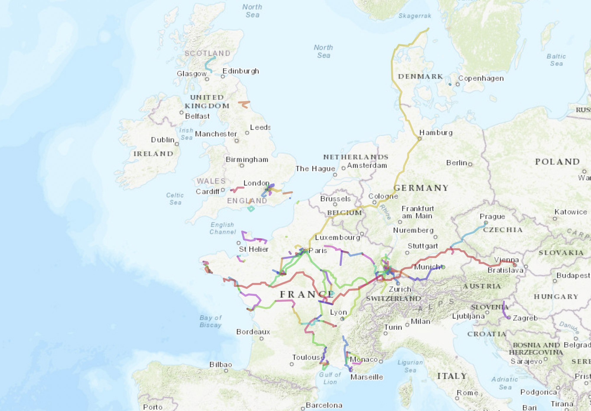

# Cycling palimpsest

<p align="center">
  
</p>

Plot everything you've ever cycled on a single
map, from your [Komoot](https://www.komoot.com) account. I'm sure it's easy to adapt to garmin connect or strava if you don't use Komoot (which you should).
This repo has been shamelessly vibe coded, using Pi coding agent, with glm 5.2 - and a bit of Opus 4.8 in chat mode.

This repo is a two-step pipeline:

1. **`KomootExport/`** — a small Go tool that logs into Komoot with your
   session cookie and downloads every tour (GPX + map image + cover photos)
   into one folder. You should export only `tour_recorded` (your real, GPS
   tracked rides). You can also drop in any extra `.gpx` files you have lying
   around (a ride you forgot to record, an old Strava export, …) — the plotter
   doesn't care where the GPX comes from.
2. **`trace_map.py`** — a Python script that recursively scans a folder for
   `.gpx` files, draws every track as a thin line on a minimalist basemap, and
   writes a single self-contained `.html` file you can open in any browser.

The result is one HTML page (see `carte.html` for an example) showing a
lifetime of riding, with overlapping routes naturally darkening where you've
been the most. It's an interactive map, so you can zoom for a more detailed view.

---

## 1. Export your Komoot tours

[`KomootExport/`](KomootExport) is a small Go downloader (originally from
[jlelse/KomootExport](https://git.jlel.se/jlelse/KomootExport/src/branch/master/README.md))
that pulls your tours straight from Komoot's web API using your session cookie.

### Find your Komoot credentials

To use it, you need your Komoot user ID and session cookie. Here's how to get
them:

**user_id**

1. Log in to https://www.komoot.com in your browser.
2. Go to https://www.komoot.com/account/details.
3. Look for your user ID on the page. It is a long number (e.g. `123456789`).

**cookie**

1. Log in to https://www.komoot.com in your browser.
2. Open the browser developer tools (usually `F12` or `Ctrl+Shift+I`).
3. Go to the "Network" tab.
4. Reload the page or perform any action that sends a request.
5. Click on any request to https://www.komoot.com.
6. In the request details, find the "Request Headers" section.
7. Look for the "Cookie" header and copy its entire value.
8. Paste the value into your `creds.yaml` file. It should start with or contain
   `kmt_sess=...`.

Your `KomootExport/creds.yaml` should look like this:

```yaml
user_id: "your_user_id"
cookie: "your_cookie_string"
```

### Download your tours

Then, from inside that folder, download your **recorded** tours into its
`routes/` folder:

```bash
cd KomootExport
go run . \
    --toursDir routes \
    --tourType tour_recorded \
    --includeTitleInDir --includeDateInDir --includeTypeInDir
```

- `--tourType tour_recorded` — only your actually-tracked tours. Use
  `tour_planned` instead if you also want routes you only have as planned.
- The `--include*InDir` flags give each folder a readable name like
  `2156208515 2025-04-12 racebike Vélo de route – Pont de Couzon`. They're
  optional but make the on-map tooltips much nicer.

Each tour ends up in its own subfolder containing `tour.gpx`, `map.jpg` and
cover images.

### Adding extra GPX files

Want to include rides that aren't on Komoot? Just drop the `.gpx` anywhere
under `KomootExport/routes/` (a flat file or its own subfolder, doesn't
matter). The plotter scans recursively, so anything ending in `.gpx` will be
picked up.

---

## 2. Plot the map

Requirements:

```bash
pip install gpxpy folium
```

Basic usage — plot everything under the Komoot export folder:

```bash
python trace_map.py KomootExport/routes
```

This writes `carte.html` (default). Open it in a browser and zoom around.

### Options

```
python trace_map.py FOLDER [options]
```

| Option | Default | Description |
| --- | --- | --- |
| `FOLDER` (positional) | — | Folder to scan recursively for `.gpx` files. |
| `-o, --output` | `carte.html` | Output HTML file. |
| `--color` | `#1f3b57` | Line color (any CSS hex/name). A dark slate blue by default. |
| `--weight` | `2.0` | Line thickness in pixels. |
| `--opacity` | `0.55` | Line opacity, `0`–`1`. Low values let overlapping tracks darken naturally — a free density hint. |
| `--basemap` | `positron` | Basemap style (see below). |
| `--every` | `1` | Keep 1 point out of N to lighten large outputs (e.g. `--every 3`). |
| `--max-gap` | `1.0` | Cut a track wherever two consecutive points are more than this many km apart, dropping straight-line artifacts (train transfers, GPS drop-outs, forgotten pauses). `0` disables. |
| `--multicolor` | off | Give each GPX file its own color, spread evenly across the hue wheel. Overrides `--color`. |
| `--stadia-key` | — | Stadia Maps API key. Only needed for the `watercolor` / `terrain*` Stamen basemaps when opening the HTML as a local file (not needed when served from `localhost`). |
| `--arcgis-key` | — | ArcGIS Location Platform key. Required for the `modern-antique` and `midcentury` basemaps (free non-commercial account at location.arcgis.com). |

### Basemaps (`--basemap`)

Minimal / clean:

- `positron` *(default)* — light grey, very minimalist.
- `voyager` — light with more labels.
- `dark` — dark matter.
- `osm` — standard OpenStreetMap.
- `positron-nolabels`, `voyager-nolabels`, `dark-nolabels` — same as above but without city/country text.

Topographic / relief (great for spotting how much climbing you did):

- `opentopo` — OpenTopoMap, contours + hillshade + rivers.
- `esri-topo` — classic Esri topographic.
- `esri-relief` — shaded relief only, low detail, great overview.
- `cyclosm` — cycling-oriented OSM with relief.
- `terrain-bg` — Stamen terrain hillshade, no labels (needs `--stadia-key` locally).
- `terrain` — classic warm Stamen hillshade (needs `--stadia-key` locally).

Stylized:

- `watercolor` — Stamen parchment/painted look (needs `--stadia-key` locally, max zoom 16).
- `modern-antique` — Esri Modern Antique (needs `--arcgis-key`).
- `midcentury` — Esri Midcentury (needs `--arcgis-key`).

### Examples

A clean dark map with thin, semi-transparent lines:

```bash
python trace_map.py KomootExport/routes --basemap dark --color "#7fd1ff" --weight 1.5 --opacity 0.45
```

Topo basemap with each ride in its own color:

```bash
python trace_map.py KomootExport/routes --basemap opentopo --multicolor
```

Big library of files — decimate to keep the HTML light and drop train gaps:

```bash
python trace_map.py KomootExport/routes --every 3 --max-gap 2 --output big.html
```

Parchment / watercolor look (needs a free Stadia key for local files):

```bash
python trace_map.py KomootExport/routes --basemap watercolor --stadia-key YOUR_KEY --color "#5a3a22"
```

---

## How it works

- The Go downloader walks Komoot's web API using your session cookie, lists
  your tours for the chosen type, and fetches the GPX, map thumbnail and cover
  photos for each, with a small delay between requests to stay polite.
- `trace_map.py` recursively finds every `.gpx`, parses tracks and routes with
  `gpxpy`, optionally splits them on large gaps so you don't get a stray line
  across the map when you took a train, and renders each one as a
  `folium.PolyLine` (Leaflet under the hood) on the chosen basemap. Tooltips
  show the file path relative to the scanned folder on hover. The view auto
  -fits to the bounding box of all your tracks, and the result is a single
  self-contained HTML file.

## Repository layout

```
.
├── KomootExport/        # Go tool: download tours from Komoot (see its own README)
│   ├── main.go
│   ├── creds.yaml       # your Komoot user_id + cookie (not committed)
│   ├── routes/          # downloaded tours land here (one folder per tour)
│   └── README.md
├── trace_map.py         # Python plotter
└── carte.html           # example output (generated)
```

## Notes

- `creds.yaml` and the `routes/` contents are personal data — keep them out of
  git (the subfolder's `.gitignore` already handles `creds.yaml`).
- If Komoot returns random errors mid-download, delete the last tour's folder
  and re-run the downloader.
- The output HTML can get large with hundreds of tours; `--every` and
  `--max-gap` are your friends.
